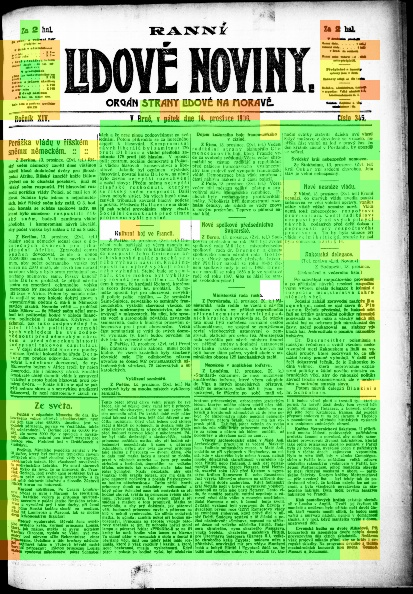
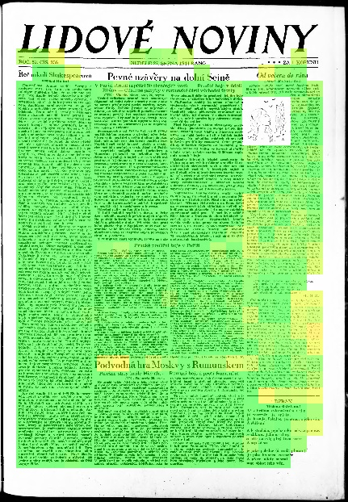

# pero-quality

This repository contains scripts used for digitalized document quality  assessment. The main goal is to produce a heatmap with quality score, which is similar to human perception. The module computes local scores based on probability scores extracted from character recognition. More detailed description is located below.

 

On the inside score evaluation uses text recongition, which works in multiple stages. Firstly, locations of paragraphs are determined. These are the areas, which contain text. Line detector is executed on each of these areas, storing coordinates of each detected line. These are used for character recongition. Each line is split into columns, and probability for each character is computed over all columns. The best scenario is, that probability for one of the characters is 1 and 0 for all the others. These probabilities are then grouped into local areas, and used for score computation. 

## Install

```bash
git clone https://github.com/DCGM/pero-quality.git
cd pero-quality
pip install -r requirements.txt
```

**Note**: One of the requirements is `tensorflow-gpu`. If you don't have GPU support installed, refer to instructions for [tensorflow GPU support]([https://www.tensorflow.org/install/gpu](https://www.tensorflow.org/install/gpu) or substitute package for `tensorflow`.

## Usage

**Note**: pero and pero_quality modules must be in `PYTHONPATH` to use `QualityEvaluator` class

```
export PYTHONPATH=/abs/path/pero-quality/pero:/abs/path/pero-quality/pero_quality:$PYTHONPATH
```

Before processing a document, you need to download configuration and models needed for line detection and character recongnition. This is done by launching `models/download_models.py` script, or using link located below.

The class encapsulating quality assessment is located in `quality_evaluator` module. Working with the module is shown below:

```python
quality = QualityEvaluator(config_path)
image = cv2.imread(filepath, cv2.IMREAD_COLOR)
score, heatmap = quality.evaluate_image(image)
```

More verbose example is located in `pero_quality` module. To process images and save them highlighted as shown above, launch the module as: 

```bash
python3 pero-quality.py config/path input/path -o output/path -v
```

Both input path and output path both must be directory paths or file paths. Additional info about parameters is printed using single `-h`  argument.

## Models

| The model is train on dataset created from [Lidove noviny](http://www.digitalniknihovna.cz/mzk/periodical/uuid:bdc405b0-e5f9-11dc-bfb2-000d606f5dc6). Text is written in czech language and scanned using microfilm scanner to approx. 6000x4000 pixels. | [Lidove noviny__2019-12-16](http://www.fit.vutbr.cz/~ihradis/pero-models/ocr_quality_LN_2019-12-16.zip) |
| -------------------------------------------------------------------------------------------------------------------------------------------------------------------------------------------------------------------------------------------------------- | ------------------------------------------------------------------------------------------------------- |
| more will be added                                                                                                                                                                                                                                       |                                                                                                         |

## Docker support

If you don't want to install this package on your system, you can use docker, which will create a separate container for this module.

`docker` directory contains basic info about how to run this repository in docker. Dockerfile will be enough for users familiar with docker, and scripts `run.sh` and `build.sh` are here for new users.

### Prerequisites

- [docker](https://docs.docker.com/install/linux/docker-ce/ubuntu/#install-docker-engine---community-)

- [nvidia docker](https://github.com/NVIDIA/nvidia-docker) support

### Usage

Note: use sudo with docker commands if user is not in `docker` group

1. build image: `build.sh`

2. create and run container: `run.sh`


